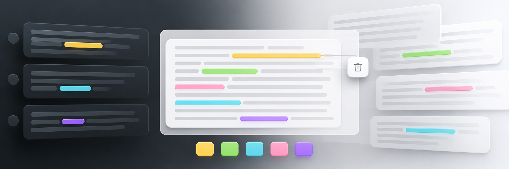
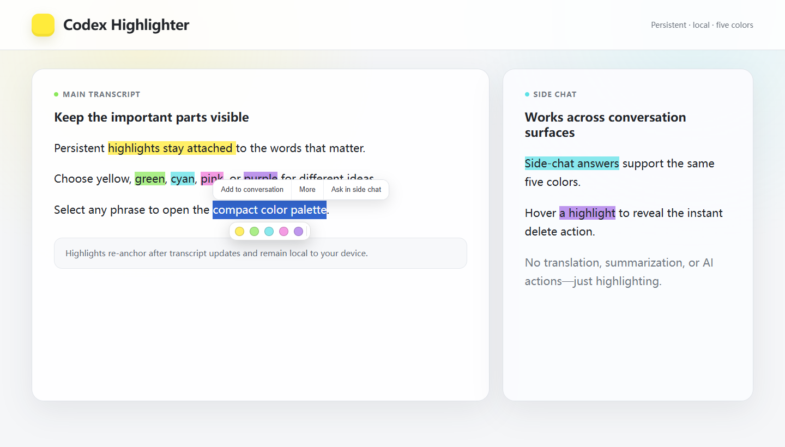
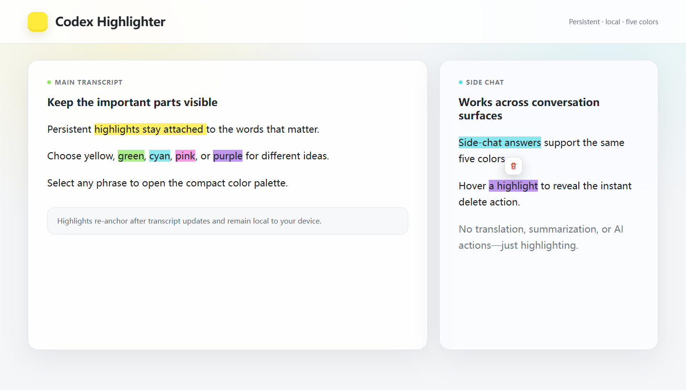

# Codex Highlighter

[English](README.md) | 简体中文

<p align="center">
  
</p>

<p align="center"><strong>让 Codex 桌面端的重要文字真正留在视线里。</strong></p>

<p align="center">
  
  
  
</p>

> 非官方社区项目，与 OpenAI 无隶属或背书关系。Codex 更新可能改变内部页面结构并暂时影响兼容性。

Codex Highlighter 为 Windows 版 Codex 桌面应用增加一个功能：在聊天正文中选中文字，选择颜色，保留高亮。

它不包含翻译、解释、总结、AI 提示词或全局屏幕标记。

托盘菜单提供原生数据管理窗口，可以搜索、删除、清空、导入和导出高亮记录。

## 功能演示

<p align="center">
  
</p>

<details>
  <summary><strong>查看鼠标悬停删除</strong></summary>
  <br>
  
</details>

> 演示截图由仓库中的真实注入脚本在隐私安全的本地测试页面上自动生成，不包含个人 Codex 对话。

## 快速开始

需要 Windows 10/11 和 Codex 桌面应用。

### 安装发布版

1. 从 [GitHub Releases](https://github.com/andyxueanan-dot/codex-highlighter/releases/latest) 下载 `codex-highlighter-v1.1.1-windows-x64.zip`。
2. 解压后在 PowerShell 中运行 `install.ps1`。
3. 安装器使用当前用户目录，不需要管理员权限。

### 从源码构建

```powershell
git clone https://github.com/andyxueanan-dot/codex-highlighter.git
cd codex-highlighter
.\build.ps1
.\Start-Codex-Highlighter.cmd
```

1. 第一次启用时，程序会询问是否重启 Codex。选择“是”。
2. 在 Codex 主对话或右侧对话中选中文字。
3. 在选区下方选择黄、绿、青、粉、紫任一颜色。
4. 鼠标悬停高亮文字，点击垃圾桶即可删除。

重新框选已有高亮时，也可以直接改色或点击垃圾桶删除。

也可以在选中文字后按 `Ctrl+Shift+H` 添加或取消高亮。

右键黄色托盘图标并选择“管理高亮数据”，可以搜索记录、删除选中、清空全部以及导入/导出 JSON 备份。

颜色工具条会优先显示在选区下方，并避开 Codex 自带的“添加到对话”“更多”和“在侧边聊天中提问”菜单。程序运行后位于 Windows 系统托盘。退出托盘程序会立即撤掉当前页面上的高亮，但保留数据；下次启动后会恢复。

## 为什么第一次需要重启 Codex

Codex 没有向普通插件开放聊天正文的选区和样式接口。本工具让 Codex 以仅绑定 `127.0.0.1` 的 Chrome DevTools Protocol 端口启动，再把高亮脚本注入真实的 Chromium 文本页面。

它不会修改：

- Codex 官方安装目录或 `app.asar`
- Codex 代码签名
- 登录状态、API 配置或任务数据
- 注册表、计划任务或开机启动项

## 持久化与稳定性

高亮数据保存在：

```text
%LOCALAPPDATA%\CodexHighlighter\highlights.json
```

每条高亮保存任务地址、消息指纹、原文、前后文和文字位置。页面滚动、React 重新渲染或重新打开任务时，脚本会重新定位文字。显示使用 Chromium CSS Highlights API，不修改 React 管理的聊天 DOM。

当前已验证 Codex `26.818.5229.0`、Chromium 151。Codex 更新如果改变内部页面结构，托盘会显示连接异常；重新加载失败时可退出工具，Codex 本身仍可正常使用。日志位于：

```text
%LOCALAPPDATA%\CodexHighlighter\CodexHighlighter.log
```

## 构建和测试

项目使用 Windows 自带的 .NET Framework C# 编译器，不需要安装 .NET SDK：

```powershell
.\build.ps1
```

输出文件：

```text
dist\CodexHighlighter.exe
```

完整自动测试：

```powershell
.\tests\run-tests.ps1
```

测试覆盖 JavaScript 语法、嵌入资源、数据格式、Codex 安装定位、本机端口，以及真实 Chromium 中的主/侧对话选区、五色高亮、原生菜单避让、DOM 重建后重新锚定、相邻选区、改色和悬停删除。

## 删除

1. 从系统托盘退出 Codex Highlighter。
2. 删除本项目目录。
3. 如果也要删除所有高亮记录，再删除 `%LOCALAPPDATA%\CodexHighlighter`。

没有其他安装项需要清理。

## 安全提示

工具运行期间，Codex 会开放一个仅绑定 `127.0.0.1` 的调试端口。同一 Windows 账户下的其他本地进程理论上也可能访问它。不要在不可信的共享账户中使用；不需要高亮时可退出托盘工具并正常重启 Codex。详见 [SECURITY.md](SECURITY.md)。

已验证的 Windows、Codex 与 Chromium 版本见[兼容性矩阵](docs/COMPATIBILITY.md)。

## 开源许可

本项目采用 [MIT License](LICENSE)。这是非官方社区工具；Codex、ChatGPT 和 OpenAI 是其各自权利人的商标。

## 第三方参考

Windows Codex 发现、仅回环 CDP 启动和运行时恢复设计参考了 MIT 许可的 [CodeFace](https://github.com/sundy-li/CodeFace)。文字锚定策略参考了 BSD-2-Clause 许可的 [Hypothesis client](https://github.com/hypothesis/client)。详见 `licenses/THIRD_PARTY_NOTICES.md`。
